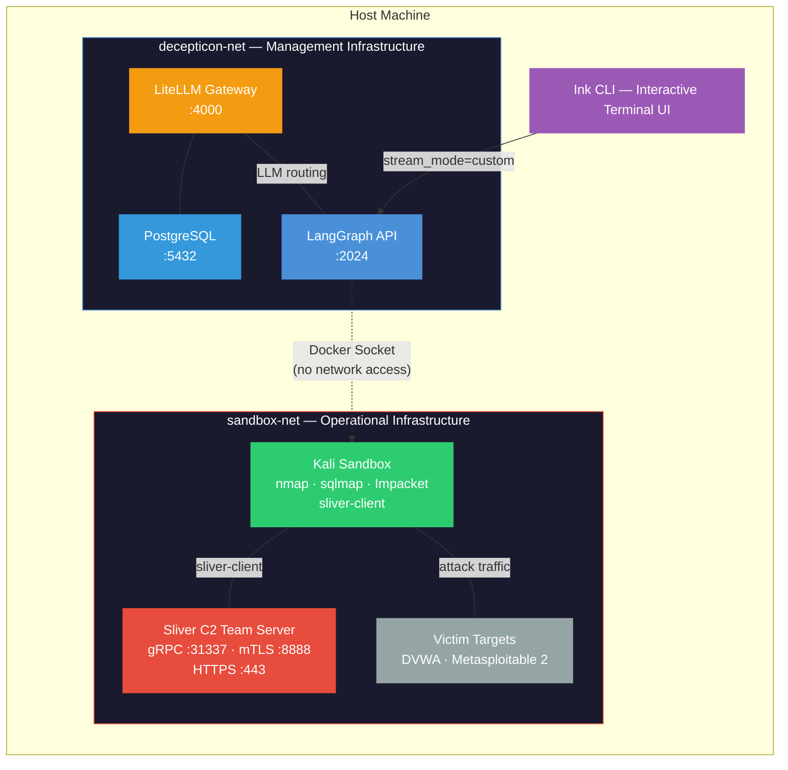

[](README.md)
[](./docs/README_KO.md)


<div align="center">
  
</div>

<h1 align="center">Decepticon — Autonomous Hacking Agent</h1>

<p align="center"><i>"Another AI hacker? Let us guess — it runs nmap and writes a report. Groundbreaking. Then what?"</i></p>

<div align="center">

<a href="https://github.com/PurpleAILAB/Decepticon/blob/main/LICENSE">
  
</a>
<a href="https://github.com/PurpleAILAB/Decepticon/stargazers">
  
</a>
<a href="https://github.com/PurpleAILAB/Decepticon/graphs/contributors">
  
</a>

<br/>

<a href="https://discord.gg/TZUYsZgrRG">
  
</a>
<a href="https://purplelab.framer.ai">
  
</a>
<a href="https://docs.decepticon.red">
  
</a>

</div>

<br/>

<div align="center">
  <video src="https://github.com/user-attachments/assets/b3fd40d8-e859-4a39-97f4-bd825694ad96" width="800" controls></video>
</div>

## Install

**Prerequisites**: [Docker](https://docs.docker.com/get-docker/) and Docker Compose v2. That's it.

```bash
curl -fsSL https://raw.githubusercontent.com/PurpleAILAB/Decepticon/main/scripts/install.sh | bash
```

Then configure your API key and start:

```bash
decepticon config    # Set your Anthropic or OpenAI API key
decepticon           # Launch
```

## Try the Demo

Configure your API key first, then run the demo — nothing else needed.

```bash
decepticon config    # Set your API key (one-time)
decepticon demo
```

Launches Metasploitable 2 as a target, loads a pre-built engagement, and runs the full kill chain automatically: port scan, vsftpd exploit, Sliver C2 implant deployment, credential harvesting via C2, and internal network reconnaissance.

---

> **Disclaimer** — Do not use this project on any system or network without explicit written authorization from the system owner. Unauthorized access to computer systems is illegal. You are solely responsible for your actions. The authors and contributors of this project assume no liability for misuse.

---

## What is Autonomous Hacking?

Let's be honest. The "AI + hacking" space is exhausting.

Every other week, someone drops a demo: *"Look, GPT can run nmap!"* Cool. Then what? It either ends up as a party trick that no one actually uses in production — or worse, it crosses a line nobody should cross.

> *"Yet another AI pentesting tool... cool demo. But when does it actually do something a real attacker would?"*

Fair question. Here's our answer.

**Autonomous Hacking** is the next evolution in offensive security. It's not about making hacking easier or more accessible. It's about making **real Red Team operations** executable at machine speed — with the rigor, documentation, and legal framework that separates professionals from script kiddies.

Traditional red teaming demands hundreds of hours of manual work — scanning, enumerating, pivoting, documenting — most of it repetitive, all of it exhausting. Meanwhile, the attack surface grows faster than any human team can cover.

Autonomous Hacking changes the equation. AI agents handle the grind: running scans, analyzing output, chaining techniques, and adapting in real time. The human sets the mission, defines the rules, and focuses on what machines still can't do — intuition, judgment, and creative thinking.

> *"Delegate the repetitive. Focus on the decisive."*

## "But wait — aren't you guys just the same?"

Great question. Short answer: **No.**

Here's the thing most people miss about offensive security — there's a massive difference between *hacking* and *Red Team Testing*.

Red Team Testing is a **regulated, authorized, professional discipline**. Before a single packet leaves the wire, there are documents. Agreements. Rules.

- **RoE (Rules of Engagement)** — Defines what you can and can't touch. Scope, timing, boundaries. Violate this and you're not a red teamer, you're a criminal.
- **ConOps (Concept of Operations)** — Threat actor profile, attack methodology, the "who are we pretending to be" document.
- **Deconfliction Plan** — Separates red team activity from real threats. Source IPs, user-agents, time windows, and a shared code for real-time deconfliction calls with the SOC.
- **OPPLAN (Operations Plan)** — The full mission plan. Objectives, kill chain phases, acceptance criteria. Every action maps to a purpose.

**Decepticon supports all of this. Obviously.**

Every engagement starts with proper documentation. Every objective is tracked. Every action operates within defined boundaries. The agent doesn't just hack — it operates under a formal operations plan, respects the Rules of Engagement, and produces auditable findings.

This isn't a toy. It's a professional Red Team platform that happens to be autonomous.

## Why Decepticon?

Penetration testing finds vulnerabilities. Red teaming answers a harder question: *can your organization survive a real attack?*

Most security tools stop at the scan report. Decepticon doesn't. It thinks in kill chains — reconnaissance, exploitation, privilege escalation, lateral movement, persistence — executing multi-stage operations the way a real adversary would, not the way a scanner does.

Three principles guide everything we build:

**Real Red Teaming, Not Checkbox Security**
Decepticon emulates actual adversary behavior — not just running CVE checks against a list of ports. It reads an operations plan, adapts to what it finds, and pursues objectives through whatever path opens up. The goal is to test your defenses the way they'll actually be tested.

**Complete Isolation — Real Red Team Infrastructure**
Every command runs inside a hardened Kali Linux sandbox on a dedicated operational network (`sandbox-net`), fully isolated from the management infrastructure (`decepticon-net`). The C2 team server, victim targets, and the operator sandbox live on one network; the LLM gateway, agent API server, and database live on another. No cross-network access. LangGraph reaches the sandbox exclusively via Docker socket — not the network. You get the full offensive toolkit — nmap, Sliver C2, sqlmap, Impacket — without any risk of leaking credentials or touching the host.

**CLI-First**
Security work belongs in the terminal. Decepticon's interface is a real-time streaming CLI built with Ink — no browser tabs, no dashboards, no context switching. You see what the agent sees, as it happens.

## The Bigger Picture: Offense Serves Defense

Here's what most "offensive AI" projects get wrong: they treat the attack as the destination.

**Decepticon is not the destination. It's Step 1.**

> There are already plenty of offensive AI agents out there. The world doesn't need another "look, AI can hack things" demo.

What the world actually needs is a system that turns offensive capabilities into **defensive evolution**. That's the real vision:

1. **Step 1 — Autonomous Offensive Agent**: Build a world-class hacking agent that executes realistic Red Team operations. *We are here.*
2. **Step 2 — Infinite Offensive Feedback**: Deploy the agent to generate continuous, diverse attack scenarios — an endless stream of real-world threat simulation.
3. **Step 3 — Defensive Evolution**: Channel that feedback into Blue Team capabilities — detection rules, response playbooks, hardening strategies. The defense evolves because the offense never stops.

Think of it as an **Offensive Vaccine**. Just as a biological vaccine exposes the body to weakened pathogens to build immunity, Decepticon exposes your infrastructure to relentless AI-driven attacks to build resilience.

The true value isn't in the attack. It's in the defense system that emerges from surviving it.

## Architecture

Decepticon separates **management infrastructure** from **operational infrastructure** — the same way a real red team separates its planning systems from its attack infrastructure.



**Why two networks?** The sandbox has zero access to the LLM gateway, database, or agent API. If a target compromises the sandbox, it reaches nothing of value — just like a real red team isolates its C2 infrastructure from its internal systems. LangGraph controls the sandbox exclusively through Docker socket (`docker exec`), not through the network.

**C2 Infrastructure**: The Sliver team server runs in its own container on the operational network. The sandbox has `sliver-client` pre-installed and auto-connects using a config generated at first boot (`/workspace/.sliver-configs/decepticon.cfg`). C2 is profile-based — swap `COMPOSE_PROFILES=c2-sliver` for a different framework without touching the rest of the stack.

**LLM Routing**: LiteLLM acts as a unified API gateway, routing to any LLM backend (Anthropic, OpenAI, local models) with usage tracking, rate limiting, and key management via PostgreSQL.

## Agents

Decepticon runs a **multi-agent system** where a central orchestrator delegates to specialist agents, each with its own tools, skills, and context window.

| Agent | Role |
|-------|------|
| **Decepticon** | Orchestrator. Reads the OPPLAN, coordinates the kill chain, delegates tasks to specialists. Owns objective tracking via OPPLAN tools. |
| **Soundwave** | Intelligence officer. Interviews the operator and generates engagement documents — RoE, ConOps, and Deconfliction Plan. Does not execute commands. |
| **Recon** | Reconnaissance and enumeration. Runs scans, discovers services, maps attack surface inside the sandbox. |
| **Exploit** | Exploitation. Attempts initial access through discovered vulnerabilities, credentials, or misconfigurations. |
| **Post-Exploit** | Post-exploitation. Credential access, privilege escalation, lateral movement, C2 management, and data collection. |

Each agent spawns with a **clean context window** per objective — no accumulated noise, no degraded reasoning. Findings persist to disk, not to memory, so every iteration starts sharp.

Every agent is built with an explicit **middleware stack** tailored to its role — skills for domain knowledge, filesystem access for the sandbox, model fallback for resilience, and prompt caching for efficiency. The orchestrator additionally has OPPLAN tools (add/get/list/update objectives) and sub-agent delegation via `task()`.

## CLI Commands

| Command | Description |
|---------|-------------|
| `decepticon` | Start all services and open the interactive CLI |
| `decepticon demo` | Run guided demo against Metasploitable 2 (full kill chain + Sliver C2) |
| `decepticon stop` | Stop all services |
| `decepticon update [-f]` | Pull latest images and sync configuration (`--force` to re-pull same version) |
| `decepticon status` | Show service status |
| `decepticon logs [service]` | Follow service logs (default: langgraph) |
| `decepticon config` | Edit API keys and settings |
| `decepticon victims` | Start vulnerable test targets (DVWA, Metasploitable) |
| `decepticon remove` | Uninstall Decepticon completely |
| `decepticon --version` | Show installed version |

## Vision & Philosophy

This README covers the essentials — but there's a deeper story behind why Decepticon exists, where it's headed, and the philosophy that drives every design decision.

**[Read the full vision and philosophy at docs.decepticon.red](https://docs.decepticon.red)**

Topics covered in the documentation:
- **Core Philosophy** — Reasoning over signatures, hybrid intelligence, stealth as foundation
- **Pentesting vs. Red Teaming** — Why the distinction matters and where Decepticon sits
- **History & Evolution** — From Purple Team AI (2021) through RL and GANs to today's autonomous agents
- **Target Architecture** — Multi-agent hybrid architecture, C2-based stealth execution
- **Why Open Source** — Collective intelligence and the Red/Blue Team feedback loop

## Contributing

We welcome contributions. Whether you're a security researcher, an AI engineer, or someone who cares about making defense better — there's a place for you here.

**Developer Setup** (for contributors):

```bash
git clone https://github.com/PurpleAILAB/Decepticon.git
cd Decepticon

# Python agents
uv sync --dev

# CLI client
cd clients/cli && npm install && cd ../..

# Run locally
docker compose up -d --build
cd clients/cli && npm run dev
```

1. Fork the repository
2. Create a feature branch
3. Commit with clear messages
4. Open a Pull Request

For architecture details and contribution guidelines, visit the [documentation](https://docs.decepticon.red).

## Community

Join the [Discord](https://discord.gg/TZUYsZgrRG) — ask questions, share engagement logs, discuss techniques, or just connect with others who believe defense starts with understanding offense.

## License

[Apache-2.0](LICENSE)

---

<div align="center">
  
</div>
